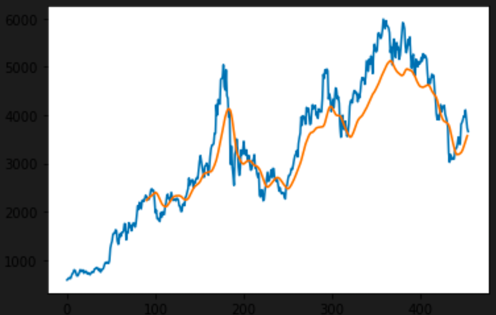

# Ethereum-Forecaster
Ethereum-Forecaster is a stacked LSTM model with 3, 50 unit layers that forecasts ETH-CAD for the month of February. As of Feb 14, 2022, it has accurately predicted the dip in price and predicts that ETH will hit nearly $3,000 CAD by the end of the month. Data was scraped from Yahoo Finance and preprocessed using pandas and scikit-learn, the model was generated using TF Keras, training was done on an AWS EC2 instance, and plotting was done using Matplotlib.

The blue graph entails the training data while the orange is the output of the model on training data:

The following graph is the predicted price of ETH in CAD until the end of February. The prediction starts from '450' on the x-axis.

